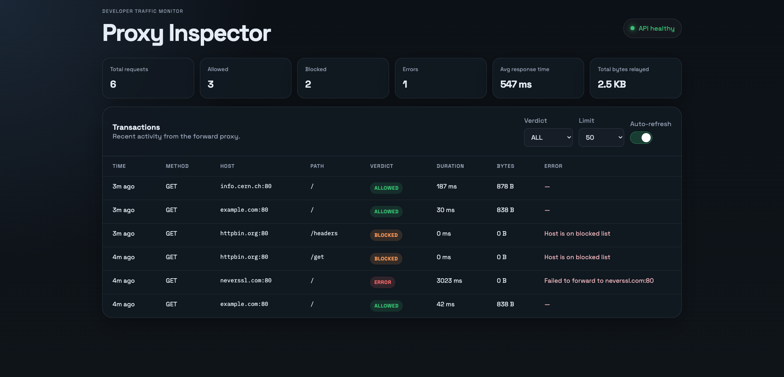

# Proxy Inspector

Proxy Inspector is a custom HTTP forward proxy written in Java with a developer-facing monitoring dashboard built in React and TypeScript.

The project accepts HTTP traffic through a local proxy, applies simple policy rules, forwards allowed requests to the target server, records each transaction, and exposes a REST API used by the dashboard for live monitoring.

## Dashboard Preview



## Features

- Custom HTTP forward proxy built without heavyweight frameworks
- Rule-based request control
- Host blocking
- Path blocking per host
- Basic per-client-IP rate limiting
- Transaction logging with verdict, duration, bytes relayed, and error details
- Read-only REST API for monitoring and dashboard integration
- Single-page dashboard for traffic overview and recent transaction inspection

## Architecture

The project consists of two main parts:

1. `proxy-inspector/`
   - Java 17 backend
   - HTTP forward proxy
   - In-memory transaction store
   - Monitoring REST API

2. `frontend/`
   - React + TypeScript dashboard
   - Polls the local API for health, stats, and recent transactions

High-level flow:

```text
Client -> Proxy Inspector -> Target Server
              |
              v
      Transaction Store -> REST API -> Dashboard
```

## Repository Structure

```text
.
├── frontend/          # React + TypeScript dashboard
└── proxy-inspector/   # Java proxy server and REST API
```

## Requirements

- Java 17
- Maven
- Node.js 18+ and npm

## Backend

### Build

```bash
cd proxy-inspector
mvn -q -DskipTests package
```

### Run

```bash
java -jar target/proxy-inspector-1.0-SNAPSHOT.jar --mode=both
```

By default, this starts:

- the proxy server on `localhost:8888`
- the API server on `localhost:9090`

### CLI Configuration

The backend is configured through command-line arguments only.

| Option | Description | Default |
| --- | --- | --- |
| `--mode=proxy\|api\|both` | Start only the proxy, only the API, or both | `both` |
| `--proxy-port=PORT` | Port for the HTTP forward proxy | `8888` |
| `--api-port=PORT` | Port for the REST API | `9090` |
| `--max-transactions=NUMBER` | Maximum number of in-memory transactions to retain | `1000` |
| `--block-host=HOST` | Block all traffic to a host, repeatable | none |
| `--block-path=HOST:/path` | Block a specific path for a host, repeatable | none |
| `--verbose` | Enable more detailed proxy logging | disabled |
| `--help` | Print usage information | disabled |

### Example Commands

Run both proxy and API:

```bash
java -jar target/proxy-inspector-1.0-SNAPSHOT.jar --mode=both
```

Run only the proxy on a custom port:

```bash
java -jar target/proxy-inspector-1.0-SNAPSHOT.jar --mode=proxy --proxy-port=8080
```

Run only the API:

```bash
java -jar target/proxy-inspector-1.0-SNAPSHOT.jar --mode=api --api-port=9090
```

Block a host:

```bash
java -jar target/proxy-inspector-1.0-SNAPSHOT.jar --block-host=httpbin.org
```

Block multiple paths for a host:

```bash
java -jar target/proxy-inspector-1.0-SNAPSHOT.jar \
  --block-path=example.com:/admin \
  --block-path=example.com:/private
```

Run with verbose logging:

```bash
java -jar target/proxy-inspector-1.0-SNAPSHOT.jar --mode=both --verbose
```

## Frontend

### Install Dependencies

```bash
cd frontend
npm install
```

### Start the Dashboard

```bash
npm run dev
```

This starts the Vite development server. By default, the frontend expects the backend API to be available at:

```text
http://localhost:9090
```

To point the UI to another API base URL, set:

```bash
VITE_API_BASE_URL=http://localhost:9090
```

### Production Build

```bash
npm run build
```

## REST API

The backend exposes a minimal read-only API for the dashboard.

### `GET /health`

Returns a plain-text health response.

Example:

```text
ok
```

### `GET /stats`

Returns aggregated statistics for all retained transactions.

Example response:

```json
{
  "success": true,
  "status": 200,
  "data": {
    "total": 12,
    "allowed": 10,
    "blocked": 1,
    "error": 1,
    "bytesFromServerTotal": 34567,
    "avgDurationMs": 42
  },
  "error": null
}
```

### `GET /transactions`

Returns recent transactions.

Supported query parameters:

- `limit`
- `verdict`

Examples:

```bash
curl "http://localhost:9090/transactions?limit=25"
curl "http://localhost:9090/transactions?limit=50&verdict=BLOCKED"
```

Example response:

```json
{
  "success": true,
  "status": 200,
  "data": [
    {
      "timestampMs": 1737230400000,
      "method": "GET",
      "host": "example.com",
      "port": 80,
      "path": "/",
      "verdict": "ALLOWED",
      "bytesFromServer": 648,
      "durationMs": 23,
      "errorMessage": null
    }
  ],
  "error": null
}
```

## Dashboard

The dashboard is designed as a clean single-page monitoring view for local development and demos.

It includes:

- API health badge
- Stats overview cards
- Transaction table
- Verdict filter
- Limit selector
- Auto-refresh toggle
- Loading, empty, and error states

## How to Test the Project

1. Start the backend:

```bash
cd proxy-inspector
mvn -q -DskipTests package
java -jar target/proxy-inspector-1.0-SNAPSHOT.jar --mode=both --proxy-port=8888 --api-port=9090 --verbose
```

2. Start the frontend:

```bash
cd frontend
npm install
npm run dev
```

3. Generate traffic through the proxy:

```bash
curl -x http://localhost:8888 http://example.com/
curl -x http://localhost:8888 http://httpbin.org/get
```

4. Open the dashboard in the browser and confirm:

- API health is green
- stats cards update
- new transactions appear in the table
- request verdicts are shown correctly

5. Test blocking:

```bash
cd proxy-inspector
java -jar target/proxy-inspector-1.0-SNAPSHOT.jar --mode=both --block-host=example.com
```

Then:

```bash
curl -x http://localhost:8888 http://example.com/
```

You should see a `BLOCKED` transaction in the dashboard.

## Current Limitations

This project is intended as a portfolio/demo project, not a production-ready proxy.

Known limitations include:

- HTTP-focused implementation
- No HTTPS tunneling with `CONNECT`
- No TLS interception
- Request body handling is limited
- In-memory transaction storage only
- No persistent storage
- No authentication or authorization
- No production-grade hardening or observability stack

## Motivation

This project demonstrates:

- low-level HTTP and socket handling in Java
- request parsing and forwarding
- policy enforcement at the proxy layer
- REST API design without a heavyweight backend framework
- frontend dashboard design for developer tooling
- full-stack integration between backend monitoring data and UI

## Future Improvements

Possible extensions include:

- HTTPS tunneling support
- richer search and filtering in the dashboard
- live streaming updates instead of polling
- persistent storage for traffic history
- rule management from the UI
- authentication
- charts and trend visualizations

## License

This repository currently does not define a license.
